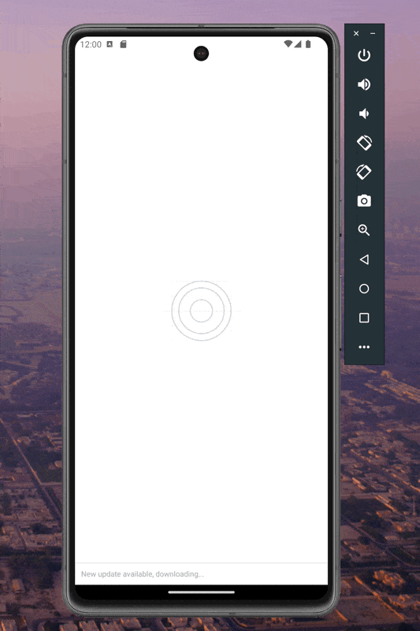

# React Native Animated Image Loader

This wrapper add a fancy and smooth image loader, using just core components without adding third dependencies.


<div style="display: flex; margin-top: 30px;">
  
  
</div>

## Installation

```sh
npm install react-native-animated-image-loader
```

## Usage

```js
import AnimatedImgLoader from 'react-native-animated-image-loader';

...
<AnimatedImgLoader
  width={100}
  height={100}
  imageUri={'https://images.pexels.com/photos/1366919/pexels-photo-1366919.jpeg'}
/>
```

## Contributing

See the [contributing guide](CONTRIBUTING.md) to learn how to contribute to the repository and the development workflow.

## License

MIT

---

Made with [create-react-native-library](https://github.com/callstack/react-native-builder-bob)
