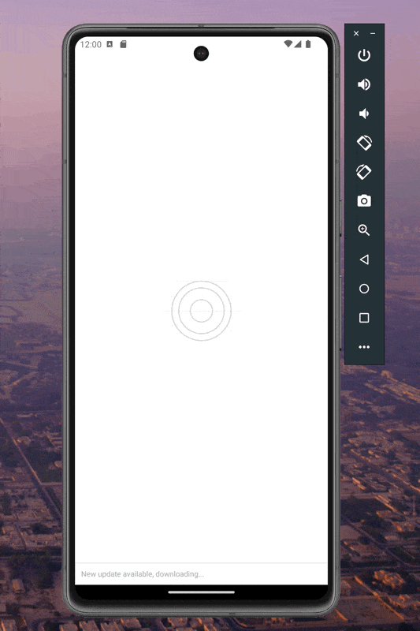

<h1></h1>

[](https://www.npmjs.com/package/react-native-animated-image-loader)
[](https://www.npmjs.com/package/react-native-animated-image-loader)

[](https://opensource.org/licenses/MIT)
[](https://prettier.io)
[](https://eslint.org/)

<table>
  <tr>
    <td align="center">
      
    </td>
    <td align="center">
      
    </td>
   </tr>
</table>

## Installation

Add the dependency: 🤔

<b>Zero Dependency</b> 🥳

### React Native
```sh
npm install react-native-animated-image-loader
```
```sh
yarn add react-native-animated-image-loader
```

### Import
```js
import AnimatedImgLoader from 'react-native-animated-image-loader';
```

## Using with Expo

Install with `npx expo install`, which picks a version compatible with your Expo SDK:

```sh
npx expo install react-native-animated-image-loader
```

This library ships custom native code (a Fabric component and a TurboModule), so it **will not run inside Expo Go** — Expo Go only bundles Expo's own pre-registered native modules and can't load arbitrary third-party native code. You'll need a [development build](https://docs.expo.dev/develop/development-builds/introduction/) instead:

```sh
npx expo prebuild
npx expo run:ios     # or: npx expo run:android
```

Or build a dev client with [EAS Build](https://docs.expo.dev/develop/development-builds/create-a-build/) if you're not building locally. See Expo's [Adding custom native code](https://docs.expo.dev/workflow/customizing/) guide for more on why a plain Expo Go install can't satisfy this and what a development build gives you instead.

## Basic Usage

```js
<AnimatedImgLoader imageUri={'url-to-your-image'} />
```

### Configuration - Props

| Property              |    Type    |                              Default                               | Description                                          |
|-----------------------|:----------:|:------------------------------------------------------------------:|------------------------------------------------------|
| **imageUri**          | **string** |                           **undefined**                            | **Required: the url of the image you want to load**  |
| loaderContainerStyles | ViewStyle  | { borderRadius: 8,width: '90%', height: 250, overflow: 'hidden', } | set your own styles for the loader container wrapper |
| skeletonStyles        | ViewStyle  |         { alignItems: 'center', justifyContent: 'center' }         | set your own styles for the skeleton component       |
| skeletonColor         |   string   |                          "rgba(0,0,0,.2)"                          | set skeleton background color                        |


## Contributing

See the [contributing guide](CONTRIBUTING.md) to learn how to contribute to the repository and the development workflow.

### Running the example app with the New Architecture

The library is being rewritten as a C++ JSI TurboModule + Fabric component (see the native rewrite tracking issue). `example/` is a managed Expo app that gets its native `ios/`/`android/` projects via `expo prebuild`, with New Architecture enabled by default (Expo SDK 54 / React Native 0.81+ ship with New Architecture on unconditionally).

**Prerequisites**
- Xcode + CocoaPods, for iOS
- Android Studio (SDK + NDK) and a JDK Gradle supports (JDK 17 is known-good; Gradle does not yet support the very latest JDKs bundled with newer Android Studio releases)

**iOS**
```sh
cd example
yarn install
npx expo prebuild --platform ios
cd ios && pod install && cd ..
yarn ios
```

**Android**
```sh
cd example
yarn install
npx expo prebuild --platform android
cd android && ./gradlew :app:assembleDebug && cd ..
yarn android
```

Both platforms build and run with New Architecture (Fabric) enabled, and the no-op TurboModule (`AnimatedImageLoader`) and Fabric component (`AnimatedImageLoaderView`) scaffolded so far are reachable from JS without crashing.

## License

MIT

---

Made with [create-react-native-library](https://github.com/callstack/react-native-builder-bob)
