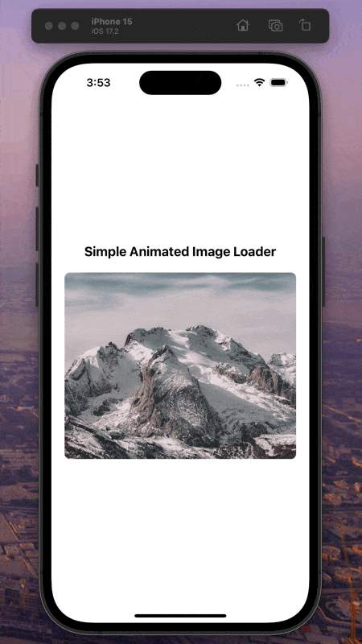

<h1></h1>

[](https://www.npmjs.com/package/react-native-animated-image-loader)
[](https://www.npmjs.com/package/react-native-animated-image-loader)

[](https://opensource.org/licenses/MIT)
[](https://prettier.io)
[](https://eslint.org/)

<table>
  <tr>
    <td align="center">
      
    </td>
    <td align="center">
      
    </td>
   </tr>
</table>

## Installation

Add the dependency: 🤔

<b>Zero Dependency</b> 🥳

### React Native
```sh
npm install react-native-animated-image-loader
```
```sh
yarn add react-native-animated-image-loader
```

### Import
```js
import AnimatedImgLoader from 'react-native-animated-image-loader';
```

## Basic Usage

```js
<AnimatedImgLoader imageUri={'url-to-your-image'} />
```

### Configuration - Props

| Property              |    Type    |                              Default                               | Description                                          |
|-----------------------|:----------:|:------------------------------------------------------------------:|------------------------------------------------------|
| **imageUri**          | **string** |                           **undefined**                            | **Required: the url of the image you want to load**  |
| loaderContainerStyles | ViewStyle  | { borderRadius: 8,width: '90%', height: 250, overflow: 'hidden', } | set your own styles for the loader container wrapper |
| skeletonStyles        | ViewStyle  |         { alignItems: 'center', justifyContent: 'center' }         | set your own styles for the skeleton component       |
| skeletonColor         |   string   |                          "rgba(0,0,0,.2)"                          | set skeleton background color                        |


## Contributing

See the [contributing guide](CONTRIBUTING.md) to learn how to contribute to the repository and the development workflow.

## License

MIT

---

Made with [create-react-native-library](https://github.com/callstack/react-native-builder-bob)
